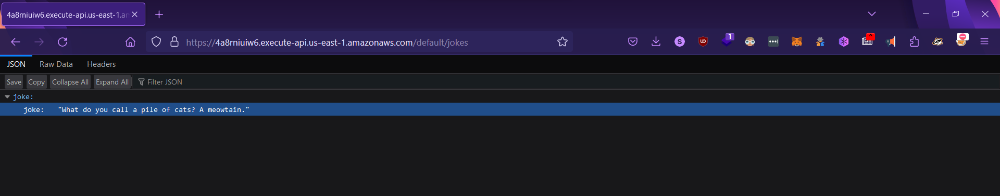
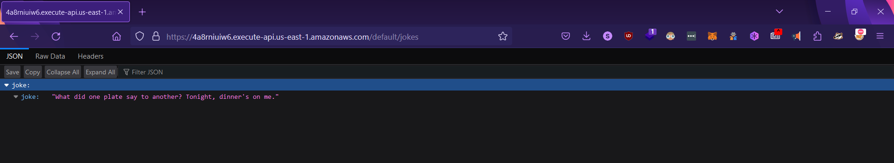

This project contains the code for an AWS Lambda function designed to fetch random jokes. The function retrieves jokes from a provided .json file.

##Deployment instructions

Runtime: Node.js 20.x
CORS: Enabled (If you are adding REST API as a trigger using AWS API Gateway)

##Screenshots of output (A REST API is used to trigger the Lambda function using AWS API Gateway)

